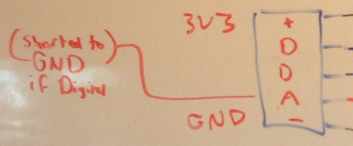

Notes December 22, 2015
=======================

* Ideas for names
	* (Severe) Pineapple - Raspberry pi sensor units
	* Base Station - Beacon
* Beacon
	* Router **($80)**
		* 30 Clients
	* Pi 2 (Latest and Greatest Pi) **($35)**
* Pineapple
	* Pi Zero - **($5 plus shipping)**
	* Wifi (investigate solder on USB) **($10.00)**
	* ADC MCP3008 **($3)**
	* JST-XH 5 pin (called: socket) **($0.06 ea)**
		* 5 pins, 8 sockets
		
	* USB Ports
		* Leave both available: 
			* One for power
			* One for hub/ethernet/usb Sensors in future
	* [16 Character display](http://goo.gl/gO4UGy) **($2.50 ea)**
	* Case & misc **($2.00)**
* Beacon Plus
	* Router **($80)**
		* 30 Clients
	* Pi 2 (Latest and Greatest Pi) **($35)**
	* All of connectors from Pineapple -> **($8)**
	* Can be used as computer too
	* **Target: People who jut want one sensor, and teachers for demos**
	